# Blueprint: Fix Compilation Errors for MVP

**Feature**: Починка 70 ошибок компиляции для достижения рабочего MVP Faugus Launcher (Rust/Iced).

**Context**: Проект мигрирует с Python/GTK3 на Rust/Iced 0.13. Текущее состояние — код не компилируется из-за изменений API в Iced 0.13, несовместимости типов, рекурсивных структур и устаревшего API tray-icon.

**Goal**: Добиться успешного `cargo check` и `cargo build` без ошибок.

[!IMPORTANT]
Iced 0.13 имеет breaking changes в styling API. Старый `iced::theme::Container::Transparent` заменён на функции `container::transparent`. Метод `on_double_press` удалён из `MouseArea`.

[!NOTE]
tray-icon crate не имеет метода `show_notification`. Для уведомлений требуется добавить `notify-rust` crate.

---

## Execution Graph

```mermaid
flowchart TD
    subgraph Phase_1[Phase 1: Structural Fixes]
        A1[Action: Fix recursive type Message/ConfirmationDialog] --> D1{cargo check: E0072 resolved?}
        D1 -- Yes --> A2[Action: Make validate method public]
        D1 -- No --> X1[[Dead End: Circular dependency requires redesign]]
        A2 --> D2{cargo check: E0624 resolved?}
        D2 -- Yes --> G1([Phase 1 Gate: cargo check structural])
        D2 -- No --> L1[Loop: Check method visibility] --> A2
    end

    subgraph Phase_2[Phase 2: Iced 0.13 API Migration]
        G1 --> A3[Action: Verify Iced container style API via docs]
        A3 --> D3{Docs confirm container::transparent exists?}
        D3 -- Yes --> A4[Action: Replace iced::theme::Container with style functions]
        D3 -- No --> X2[[Dead End: Iced API incompatible, pin older version]]
        A4 --> D4{cargo check: E0433 Container resolved?}
        D4 -- Yes --> A5[Action: Replace iced::theme::Text::Color with closure style]
        D4 -- No --> L2[Loop: Fix remaining Container usages] --> A4
        A5 --> D5{cargo check: E0433 Text resolved?}
        D5 -- Yes --> A6[Action: Fix text_input placeholder API]
        D5 -- No --> L3[Loop: Fix Text style syntax] --> A5
        A6 --> D6{cargo check: E0599 placeholder resolved?}
        D6 -- Yes --> A7[Action: Implement double-click workaround]
        D6 -- No --> L4[Loop: Move placeholder to first arg] --> A6
        A7 --> D7{cargo check: E0599 on_double_press resolved?}
        D7 -- Yes --> A8[Action: Fix button content type]
        D7 -- No --> L5[Loop: Add click timestamp tracking] --> A7
        A8 --> D8{cargo check: E0277 button resolved?}
        D8 -- Yes --> G2([Phase 2 Gate: cargo check Iced API])
        D8 -- No --> L6[Loop: Wrap String in text widget] --> A8
    end

    subgraph Phase_3[Phase 3: Imports and Types]
        G2 --> A9[Action: Add missing Length import]
        A9 --> A10[Action: Fix lossless_flow type bool vs u32]
        A10 --> A11[Action: Fix Path vs PathBuf in icon_manager]
        A11 --> A12[Action: Fix show_hidden_games field name]
        A12 --> D9{cargo check: type errors resolved?}
        D9 -- Yes --> G3([Phase 3 Gate: cargo check types])
        D9 -- No --> L7[Loop: Fix remaining type mismatches] --> A10
    end

    subgraph Phase_4[Phase 4: Task API and Derives]
        G3 --> A13[Action: Fix Task::chain to task.map]
        A13 --> A14[Action: Add PartialEq derive to GameProcess]
        A14 --> D10{cargo check: Task and derive errors resolved?}
        D10 -- Yes --> G4([Phase 4 Gate: cargo check Task API])
        D10 -- No --> L8[Loop: Check Task method signatures] --> A13
    end

    subgraph Phase_5[Phase 5: tray-icon API]
        G4 --> A15[Action: Verify tray-icon Icon/TrayIcon API via docs]
        A15 --> D11{Docs confirm Icon::from_rgba + TrayIcon::new?}
        D11 -- Yes --> A16[Action: Fix TrayIcon creation with TrayIconAttributes]
        D11 -- No --> X3[[Dead End: tray-icon version incompatible]]
        A16 --> A17[Action: Fix set_tooltip to use Option]
        A17 --> A18[Action: Add notify-rust dependency]
        A18 --> A19[Action: Replace show_notification with notify-rust]
        A19 --> A20[Action: Fix update_tooltip return type handling]
        A20 --> D12{cargo check: tray errors resolved?}
        D12 -- Yes --> G5([Phase 5 Gate: cargo check tray])
        D12 -- No --> L9[Loop: Fix remaining tray API calls] --> A16
    end

    subgraph Phase_6[Phase 6: Misc Errors]
        G5 --> A21[Action: Fix str.as_str unstable to as_ref]
        A21 --> A22[Action: Fix moved value relative in i18n]
        A22 --> A23[Action: Add type annotation in shortcuts.rs]
        A23 --> A24[Action: Fix lifetime in proton_manager_dialog]
        A24 --> D13{cargo check: all errors resolved?}
        D13 -- Yes --> G6([Phase 6 Gate: cargo check clean])
        D13 -- No --> L10[Loop: Fix remaining misc errors] --> A21
    end

    subgraph Phase_7[Phase 7: Final QA]
        G6 --> A25[Action: Run cargo clippy]
        A25 --> D14{clippy clean or only warnings?}
        D14 -- Yes --> A26[Action: Run cargo build release]
        D14 -- No, errors --> L11[Loop: Fix clippy errors without deleting code] --> A25
        A26 --> D15{Build succeeds?}
        D15 -- Yes --> T1([MVP DONE])
        D15 -- No --> L12[Loop: Fix build errors] --> G6
    end
```

---

## Node Catalog

| Node ID | Phase | Node Type | Goal | Files | Docs to Verify | Verification Tooling | Commands | Success Criteria | Failure States | On Failure | On Success |
|---------|-------|-----------|------|-------|----------------|---------------------|----------|------------------|----------------|------------|------------|
| A1 | 1 | Action | Wrap on_confirm/on_cancel in Box to break recursion | `src/gui/confirmation_dialog.rs:18-20` | N/A | N/A | cargo check | E0072, E0391 gone | Compile error persists | X1 | D1 |
| D1 | 1 | Decision | Check if recursive type error resolved | N/A | N/A | cargo check output | cargo check | No E0072 | E0072 still present | X1 | A2 |
| X1 | 1 | DeadEnd | Circular dependency requires architecture redesign | N/A | N/A | N/A | N/A | N/A | Blocked | STOP | N/A |
| A2 | 1 | Action | Change fn validate to pub fn validate | `src/gui/add_game_dialog.rs:334` | N/A | N/A | cargo check | E0624 gone | Method still private | L1 | D2 |
| A3 | 2 | Action | Verify container::transparent exists in Iced 0.13 | N/A | `docs.rs/iced/0.13.1/iced/widget/container/fn.transparent.html` | tavily_extract | N/A | Docs confirm function | 404 or missing | X2 | D3 |
| A4 | 2 | Action | Replace Container::Transparent with container::transparent | `src/gui/confirmation_dialog.rs:71,106`, `src/gui/main_window.rs:381,383,447,449,522,524`, `src/main.rs:538,565,592` | N/A | N/A | cargo check | E0433 Container gone | Errors remain | L2 | D4 |
| A5 | 2 | Action | Replace Text::Color with closure style | `src/gui/add_game_dialog.rs:658`, `src/gui/main_window.rs:434`, `src/gui/proton_manager_dialog.rs:331`, `src/gui/settings_dialog.rs:345` | `docs.rs/iced/0.13.1/iced/widget/text/struct.Style.html` | N/A | cargo check | E0433 Text gone | Errors remain | L3 | D5 |
| A6 | 2 | Action | Move placeholder from method to first arg of text_input | `src/gui/add_game_dialog.rs:510,525,545,583,602,610` | `docs.rs/iced/0.13.1/iced/widget/fn.text_input.html` | N/A | cargo check | E0599 placeholder gone | Errors remain | L4 | D6 |
| A7 | 2 | Action | Implement double-click via timestamp state tracking | `src/gui/main_window.rs:389,455,529`, `src/gui/main_window.rs` (add state field) | N/A | N/A | cargo check | E0599 on_double_press gone | Complex state logic fails | L5 | D7 |
| A8 | 2 | Action | Wrap i18n.t String in text() widget for button | `src/gui/add_game_dialog.rs:627` | N/A | N/A | cargo check | E0277 button gone | Type mismatch | L6 | D8 |
| A9 | 3 | Action | Add use iced::Length import | `src/main.rs:15` | N/A | N/A | cargo check | E0433 Length gone | Import wrong | L7 | A10 |
| A10 | 3 | Action | Change lossless_flow from u32 to bool in AddGameDialog | `src/gui/add_game_dialog.rs:108` | N/A | N/A | cargo check | E0308 type mismatch gone | Logic errors | L7 | A11 |
| A11 | 3 | Action | Change find_largest_png param from &PathBuf to &Path | `src/icons/icon_manager.rs:199` | N/A | N/A | cargo check | E0308 Path/PathBuf gone | Signature mismatch | L7 | A12 |
| A12 | 3 | Action | Rename show_hidden_games to show_hidden | `src/gui/main_window.rs:659` | N/A | N/A | cargo check | E0609 field error gone | Wrong field name | L7 | D9 |
| A13 | 4 | Action | Replace Task::chain with task.map | `src/gui/main_window.rs:169,178` | `docs.rs/iced_runtime/0.13/iced_runtime/task/struct.Task.html` | N/A | cargo check | E0308 Task args gone | API changed | L8 | A14 |
| A14 | 4 | Action | Add #[derive(PartialEq)] to GameProcess | `src/launcher/game_launcher.rs:16` | N/A | N/A | cargo check | E0369 PartialEq gone | Derive fails | L8 | D10 |
| A15 | 5 | Action | Verify Icon::from_rgba and TrayIcon::new in tray-icon | N/A | `docs.rs/tray-icon/latest/tray_icon/struct.Icon.html`, `docs.rs/tray-icon/latest/tray_icon/struct.TrayIcon.html` | tavily_extract | N/A | Docs confirm API | 404 or missing | X3 | D11 |
| A16 | 5 | Action | Create Icon then TrayIcon::new with TrayIconAttributes | `src/tray/tray.rs:87-105` | N/A | N/A | cargo check | E0599 from_rgba gone | API mismatch | L9 | A17 |
| A17 | 5 | Action | Wrap tooltip in Some() | `src/tray/tray.rs:102,129,147` | N/A | N/A | cargo check | E0308 Option gone | Type error | L9 | A18 |
| A18 | 5 | Action | Add notify-rust to Cargo.toml | `Cargo.toml` | `crates.io/crates/notify-rust` | cargo add | cargo check | Dependency added | Version conflict | L9 | A19 |
| A19 | 5 | Action | Replace show_notification with notify-rust Notification | `src/tray/tray.rs:154-161` | `docs.rs/notify-rust/latest` | N/A | cargo check | E0599 show_notification gone | API differs | L9 | A20 |
| A20 | 5 | Action | Remove ? from update_tooltip or change return type | `src/tray/tray.rs:120` | N/A | N/A | cargo check | E0277 ? operator gone | Logic error | L9 | D12 |
| A21 | 6 | Action | Replace key.as_str() with &key or key.as_ref() | `src/locale/i18n.rs:607` | N/A | N/A | cargo check | E0658 unstable gone | Syntax error | L10 | A22 |
| A22 | 6 | Action | Borrow relative with & in join calls | `src/locale/i18n.rs:53,54` | N/A | N/A | cargo check | E0382 moved value gone | Ownership error | L10 | A23 |
| A23 | 6 | Action | Add type annotation to obj.clone() | `src/steam/shortcuts.rs:89` | N/A | N/A | cargo check | E0282 type inference gone | Wrong type | L10 | A24 |
| A24 | 6 | Action | Add lifetime 'a to view_release_row | `src/gui/proton_manager_dialog.rs:407-411` | N/A | N/A | cargo check | Lifetime error gone | Lifetime mismatch | L10 | D13 |
| A25 | 7 | Action | Run clippy for additional checks | All files | N/A | cargo clippy | cargo clippy | No errors | Clippy errors | L11 | D14 |
| A26 | 7 | Action | Build release binary | All files | N/A | cargo build | cargo build --release | Binary created | Build fails | L12 | D15 |
| T1 | 7 | Terminator | MVP compilation achieved | N/A | N/A | N/A | N/A | Binary runs | N/A | N/A | DONE |

---

## Resource Map

| File | Purpose | Owner Phase |
|------|---------|-------------|
| `src/gui/confirmation_dialog.rs` | Confirmation dialog with recursive Message fields | Phase 1, 2 |
| `src/gui/add_game_dialog.rs` | Add/Edit game dialog with text_input and validation | Phase 1, 2, 3 |
| `src/gui/main_window.rs` | Main window with game list, container styles, double-click | Phase 2, 3, 4 |
| `src/gui/proton_manager_dialog.rs` | Proton version manager dialog | Phase 2, 6 |
| `src/gui/settings_dialog.rs` | Settings dialog with text styles | Phase 2 |
| `src/main.rs` | Application entry, Message enum, Length imports | Phase 1, 2, 3 |
| `src/tray/tray.rs` | System tray integration with tray-icon crate | Phase 5 |
| `src/launcher/game_launcher.rs` | Game process management, needs PartialEq | Phase 4 |
| `src/icons/icon_manager.rs` | Icon loading, Path vs PathBuf | Phase 3 |
| `src/locale/i18n.rs` | Internationalization, String ownership | Phase 6 |
| `src/steam/shortcuts.rs` | Steam shortcuts VDF handling | Phase 6 |
| `src/shortcuts/desktop_entry.rs` | Desktop shortcut creation | Phase 3 |
| `src/proton/mod.rs` | Proton module exports | Phase 1 |
| `Cargo.toml` | Dependencies, add notify-rust | Phase 5 |

---

## Invariants and Safety Bounds

| Invariant | Enforcement | Test/Check |
|-----------|-------------|------------|
| No recursive types without Box indirection | Compiler E0072 check | cargo check |
| All Iced styles use closure-based API | Manual code review | cargo check for E0277/E0599 |
| tray-icon uses Option for nullable params | Type system | cargo check E0308 |
| No unstable features on stable Rust | Compiler E0658 check | cargo check |
| All public API methods marked pub | Compiler E0624 check | cargo check |

---

## Exit Criteria

| Criteria | Evidence Node IDs |
|----------|-------------------|
| No E0072 recursive type errors | D1 |
| No E0433 unresolved imports | D4, D5 |
| No E0599 method not found errors | D6, D7, D8, D12 |
| No E0308 type mismatch errors | D9, D10 |
| No E0277 trait bound errors | D8 |
| cargo check exits with code 0 | G6 |
| cargo clippy has no errors | D14 |
| cargo build --release succeeds | D15 |
| Binary executable created in target/release | T1 |
