# Blueprint: GUI Phase 1 — Critical Blockers

**Feature Slug:** `gui-phase1-critical-blockers`  
**Created:** 2026-01-15  
**Status:** Implemented (MVP)

Данный Blueprint описывает реализацию критических недостающих элементов UI в Rust/Iced версии Faugus Launcher. Без этих компонентов приложение нефункционально: пользователь не может выбрать путь к игре, версию Proton или управлять настройками.

## Handover Note (2026-01-15)
**Implemented:**
- Phase 0: Added `rfd` 0.17 dependency.
- Phase 1: Created `src/gui/file_picker.rs` and integrated async file/folder pickers into `AddGameDialog` and `SettingsDialog`.
- Phase 2: Added `PickList` widgets for `LauncherType`, `Runner`, `InterfaceMode`, and `Language`.
- Phase 3: Integrated `ProtonManager` into `DialogState` and `main.rs` routing.

**Technical Debt:**
- `cargo check` passes, but there are numerous "unused code" warnings. This is expected as some logic (like Proton fetching details) is implemented but not fully wired or optimized yet.
- `LauncherType` enum is hardcoded.
- `ProtonManager` view is basic.

[!IMPORTANT]
Совместимость с конфигами Python-версии (`~/.config/faugus-launcher/`) обязательна. Формат `games.json` и `config.ini` должен читаться обеими версиями.

[!NOTE]
Зависимость `rfd` (Rusty File Dialogs) v0.17 требуется для нативных файловых диалогов. Iced v0.13 имеет встроенный `pick_list` widget — дополнительных зависимостей не требуется.

---

## Topology Graph

```mermaid
flowchart TD
  subgraph Phase_0[Phase 0: Dependencies]
    A0[Action: Add rfd to Cargo.toml] --> D0{Decision: cargo-check passes?}
    D0 -- Yes --> T0([Phase 0 Done])
    D0 -- No --> X0[[Dead End: rfd incompatible with iced/tokio versions]]
  end

  subgraph Phase_1[Phase 1: File Pickers]
    T0 --> A1[Action: Verify rfd async API via docs]
    A1 --> D1{Decision: AsyncFileDialog confirmed?}
    D1 -- Yes --> A2[Action: Create src/gui/file_picker.rs module]
    D1 -- No --> X1[[Dead End: rfd API mismatch — need alternative crate]]
    A2 --> D2{Decision: cargo-check passes?}
    D2 -- Yes --> A3[Action: Integrate BrowsePath in add_game_dialog.rs]
    D2 -- No --> L1[Loop: Fix module structure] --> A2
    A3 --> A4[Action: Integrate BrowsePrefix in add_game_dialog.rs]
    A4 --> A5[Action: Integrate BrowseAddApp in add_game_dialog.rs]
    A5 --> A6[Action: Integrate pickers in settings_dialog.rs]
    A6 --> D3{Decision: cargo-clippy clean?}
    D3 -- Yes --> T1([Phase 1 Done])
    D3 -- No --> L2[Loop: Fix warnings without deleting future code] --> A6
  end

  subgraph Phase_2[Phase 2: PickLists]
    T1 --> A7[Action: Verify iced::widget::pick_list API]
    A7 --> D4{Decision: pick_list signature compatible?}
    D4 -- Yes --> A8[Action: Create LauncherType enum with Display]
    D4 -- No --> X2[[Dead End: iced version mismatch]]
    A8 --> A9[Action: Add pick_list for LauncherType in add_game_dialog]
    A9 --> A10[Action: Add pick_list for Runner in add_game_dialog]
    A10 --> A11[Action: Add pick_list for Runner in settings_dialog]
    A11 --> A12[Action: Add pick_list for InterfaceMode in settings_dialog]
    A12 --> A13[Action: Add pick_list for Language in settings_dialog]
    A13 --> D5{Decision: cargo-check passes?}
    D5 -- Yes --> D6{Decision: cargo-clippy clean?}
    D5 -- No --> L3[Loop: Fix type mismatches] --> A9
    D6 -- Yes --> T2([Phase 2 Done])
    D6 -- No --> L4[Loop: Fix warnings] --> A13
  end

  subgraph Phase_3[Phase 3: Proton Manager Integration]
    T2 --> A14[Action: Add ProtonManager variant to DialogState]
    A14 --> D7{Decision: cargo-check passes?}
    D7 -- Yes --> A15[Action: Handle ProtonManagerClicked in main.rs]
    D7 -- No --> L5[Loop: Fix enum/match exhaustiveness] --> A14
    A15 --> A16[Action: Add ProtonManager view to dialog overlay]
    A16 --> D8{Decision: Dialog opens on button click?}
    D8 -- Yes --> D9{Decision: cargo-clippy clean?}
    D8 -- No --> L6[Loop: Debug message routing] --> A15
    D9 -- Yes --> T3([Phase 3 Done])
    D9 -- No --> L7[Loop: Fix warnings] --> A16
  end

  subgraph Phase_QA[Phase QA: Integration Test]
    T3 --> A17[Action: Manual test — add new game flow]
    A17 --> D10{Decision: Can select exe via file picker?}
    D10 -- Yes --> A18[Action: Manual test — change settings]
    D10 -- No --> L8[Loop: Debug file picker async] --> A3
    A18 --> D11{Decision: Can change Proton/Language/Interface?}
    D11 -- Yes --> A19[Action: Manual test — open Proton Manager]
    D11 -- No --> L9[Loop: Debug pick_list state] --> A9
    A19 --> D12{Decision: Proton Manager shows releases?}
    D12 -- Yes --> T_FINAL([Blueprint Complete])
    D12 -- No --> L10[Loop: Debug fetch/display] --> A15
  end
```

---

## Node Catalog

| Node ID | Phase | Node Type | Goal | Resource Context: Files | Resource Context: Docs to Verify | Verification Tooling | Commands | Success Criteria | Failure States | On Failure → | On Success → |
|---------|-------|-----------|------|-------------------------|----------------------------------|---------------------|----------|------------------|----------------|--------------|--------------|
| A0 | 0 | Action | Add rfd dependency | `Cargo.toml` | — | — | — | Line `rfd = "0.17"` added | Typo in version | Manual fix | D0 |
| D0 | 0 | Decision | Verify rfd compiles | — | — | cargo-check | `cargo check` | Exit 0 | Version conflict with tokio/iced | X0 | T0 |
| X0 | 0 | DeadEnd | rfd incompatible | — | crates.io/rfd, github issues | tavily_search | — | — | Requires alternative: `native-dialog` | — | — |
| A1 | 1 | Action | Verify rfd async API | — | docs.rs/rfd/0.17/rfd/struct.AsyncFileDialog | tavily_extract | — | `AsyncFileDialog::new().pick_file()` exists | API changed in 0.17 | X1 | D1 |
| D1 | 1 | Decision | API confirmed? | — | — | — | — | Method signatures match expected | Breaking changes | X1 | A2 |
| X1 | 1 | DeadEnd | rfd API mismatch | — | — | — | — | — | Consider `native-dialog` or older rfd | — | — |
| A2 | 1 | Action | Create file_picker module | `src/gui/file_picker.rs`, `src/gui/mod.rs` | — | — | — | Module exports `pick_file`, `pick_folder` | Compile errors | L1 | D2 |
| D2 | 1 | Decision | Module compiles? | — | — | cargo-check | `cargo check` | Exit 0 | Missing imports, async issues | L1 | A3 |
| L1 | 1 | Loop | Fix module structure | `src/gui/file_picker.rs` | — | — | — | — | — | A2 | — |
| A3 | 1 | Action | Integrate BrowsePath | `src/gui/add_game_dialog.rs` | — | — | — | `BrowsePath` returns `Task` with file picker | — | — | A4 |
| A4 | 1 | Action | Integrate BrowsePrefix | `src/gui/add_game_dialog.rs` | — | — | — | `BrowsePrefix` opens folder picker | — | — | A5 |
| A5 | 1 | Action | Integrate BrowseAddApp | `src/gui/add_game_dialog.rs` | — | — | — | `BrowseAddApp` opens file picker | — | — | A6 |
| A6 | 1 | Action | Integrate settings pickers | `src/gui/settings_dialog.rs` | — | — | — | Both browse buttons functional | — | — | D3 |
| D3 | 1 | Decision | Clippy clean? | — | — | cargo-clippy | `cargo clippy` | No errors, warnings allowed with `#[allow]` | Unused code warnings | L2 | T1 |
| L2 | 1 | Loop | Fix warnings | `src/gui/*.rs` | — | — | — | Use `#[allow(dead_code)]` for future code | — | A6 | — |
| A7 | 2 | Action | Verify pick_list API | — | docs.rs/iced/0.13/iced/widget/pick_list | tavily_extract | — | `pick_list(options, selected, on_select)` | — | — | D4 |
| D4 | 2 | Decision | API compatible? | — | — | — | — | Signature matches iced 0.13 | iced version mismatch | X2 | A8 |
| X2 | 2 | DeadEnd | iced mismatch | — | — | — | — | — | Check `Cargo.toml` iced version | — | — |
| A8 | 2 | Action | Create LauncherType enum | `src/gui/add_game_dialog.rs` | — | — | — | Enum with 7 variants + `Display` impl | — | — | A9 |
| A9 | 2 | Action | Add LauncherType pick_list | `src/gui/add_game_dialog.rs` | — | — | — | Dropdown renders with options | — | — | A10 |
| A10 | 2 | Action | Add Runner pick_list (AddGame) | `src/gui/add_game_dialog.rs` | — | — | — | Proton versions selectable | — | — | A11 |
| A11 | 2 | Action | Add Runner pick_list (Settings) | `src/gui/settings_dialog.rs` | — | — | — | Default runner selectable | — | — | A12 |
| A12 | 2 | Action | Add InterfaceMode pick_list | `src/gui/settings_dialog.rs`, `src/config/mod.rs` | — | — | — | List/Blocks/Banners selectable | — | — | A13 |
| A13 | 2 | Action | Add Language pick_list | `src/gui/settings_dialog.rs`, `src/locale/mod.rs` | — | — | — | Available languages shown | — | — | D5 |
| D5 | 2 | Decision | Check passes? | — | — | cargo-check | `cargo check` | Exit 0 | Type errors | L3 | D6 |
| L3 | 2 | Loop | Fix type mismatches | `src/gui/*.rs` | — | — | — | — | — | A9 | — |
| D6 | 2 | Decision | Clippy clean? | — | — | cargo-clippy | `cargo clippy` | No errors | Warnings | L4 | T2 |
| L4 | 2 | Loop | Fix warnings | `src/gui/*.rs` | — | — | — | — | — | A13 | — |
| A14 | 3 | Action | Add DialogState::ProtonManager | `src/gui/mod.rs` | — | — | — | Enum variant added | — | — | D7 |
| D7 | 3 | Decision | Check passes? | — | — | cargo-check | `cargo check` | Exit 0 | Match exhaustiveness | L5 | A15 |
| L5 | 3 | Loop | Fix enum matches | `src/main.rs`, `src/gui/*.rs` | — | — | — | — | — | A14 | — |
| A15 | 3 | Action | Handle ProtonManagerClicked | `src/main.rs` | — | — | — | Message creates dialog state | — | — | A16 |
| A16 | 3 | Action | Add ProtonManager view | `src/main.rs` or view function | — | — | — | Dialog renders in overlay | — | — | D8 |
| D8 | 3 | Decision | Dialog opens? | — | — | Manual test | `cargo run` | Click Settings → Proton Manager opens | Message not routed | L6 | D9 |
| L6 | 3 | Loop | Debug routing | `src/main.rs` | — | tracing logs | — | — | — | A15 | — |
| D9 | 3 | Decision | Clippy clean? | — | — | cargo-clippy | `cargo clippy` | No errors | — | L7 | T3 |
| L7 | 3 | Loop | Fix warnings | — | — | — | — | — | — | A16 | — |
| A17 | QA | Action | Test add game flow | — | — | Manual | `cargo run` | Full flow works | — | — | D10 |
| D10 | QA | Decision | File picker works? | — | — | Manual | — | Can select .exe file | Async not awaited | L8 | A18 |
| L8 | QA | Loop | Debug file picker | `src/gui/add_game_dialog.rs` | — | tracing | — | — | — | A3 | — |
| A18 | QA | Action | Test settings | — | — | Manual | `cargo run` | Settings save correctly | — | — | D11 |
| D11 | QA | Decision | PickLists work? | — | — | Manual | — | All dropdowns functional | State not updating | L9 | A19 |
| L9 | QA | Loop | Debug pick_list | `src/gui/settings_dialog.rs` | — | tracing | — | — | — | A9 | — |
| A19 | QA | Action | Test Proton Manager | — | — | Manual | `cargo run` | Releases load and display | — | — | D12 |
| D12 | QA | Decision | Releases shown? | — | — | Manual | — | GE-Proton list visible | Fetch fails | L10 | T_FINAL |
| L10 | QA | Loop | Debug fetch | `src/gui/proton_manager_dialog.rs` | — | tracing, network | — | — | — | A15 | — |

---

## Resource Map

| File | Purpose | Owner Phase | Create/Modify |
|------|---------|-------------|---------------|
| `Cargo.toml` | Add rfd dependency | Phase 0 | Modify |
| `src/gui/mod.rs` | Export file_picker, add DialogState variant | Phase 1, 3 | Modify |
| `src/gui/file_picker.rs` | Async file/folder picker wrappers | Phase 1 | Create |
| `src/gui/add_game_dialog.rs` | Integrate pickers + pick_lists | Phase 1, 2 | Modify |
| `src/gui/settings_dialog.rs` | Integrate pickers + pick_lists | Phase 1, 2 | Modify |
| `src/gui/proton_manager_dialog.rs` | Already exists, no changes | — | — |
| `src/main.rs` | Message routing for ProtonManager | Phase 3 | Modify |
| `src/config/mod.rs` | Display impl for InterfaceMode | Phase 2 | Modify |
| `src/locale/mod.rs` | Expose available languages list | Phase 2 | Modify |

---

## Invariants / Safety Bounds

| Invariant | Enforcement | Test/Check |
|-----------|-------------|------------|
| No deletion of existing code marked for future use | `#[allow(dead_code)]` on unused items | cargo-clippy |
| Config format compatible with Python version | Use same JSON schema for games.json | Manual comparison |
| File picker must not block UI thread | Use `Task::perform` with async | cargo-check (async fn) |
| PickList options must implement `ToString + PartialEq + Clone` | Derive macros on enums | cargo-check |
| ProtonManager dialog must be closeable | `Close` message handled | Manual test |

---

## Exit Criteria

| Criteria | Evidence Node IDs |
|----------|-------------------|
| User can browse and select game executable | D10 = Yes |
| User can select Proton version from dropdown | D11 = Yes |
| User can change interface mode (List/Blocks/Banners) | D11 = Yes |
| User can open Proton Manager from Settings | D12 = Yes |
| All code passes `cargo clippy` without errors | D3, D6, D9 = Yes |
| No regressions in existing functionality | T_FINAL reached |
